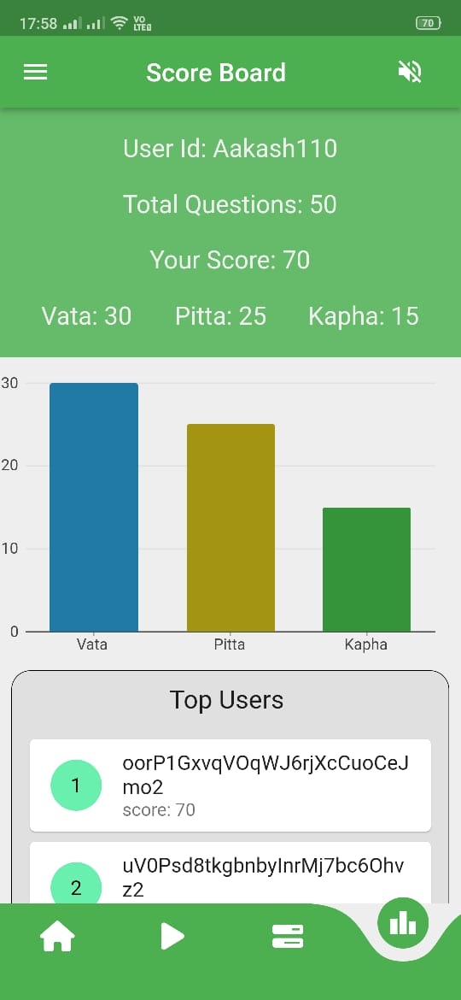

# Ayurveda 
# Ayurveda Crowdsourcing App
A Flutter project for application development 

## Description 
A Flutter-based Android application designed to collect data on Ayurveda terms (doshas) in relation to modern medical terminology. This project utilized Firebase for cloud data storage and management. The application features engaging Lottie animations, making it an appealing crowdsourcing platform. It includes a scoring system that ranks users based on the accuracy of their answers, fostering a competitive and interactive user experience.

## Snapshots of App 
 

 

## Download and run 
Requirements: 
  1. Flutter sdk 
  2. Android Studio
  3. VS code

To install flutter sdk: : https://docs.flutter.dev/get-started/install 
Install android studio and vs code from official websites. 

Download code and run: 
1. Download the zip file of the code (available above).
2. Extract the zip file  to a new directory in C: drive.
example:  C:\newfolder\flutter Apps\AyurvedaCrowdsourcing
3. Open the folder in the vs code.
5. From Explorer in vs code open the main.dart file (AyurvedaCrowdsourcing\lib\main.dart)
6. Connect the emulator. Press the No device and select the mobile emulator(if emulator is not available create android emulator). It will take little time to connect the emulator.
7. In vs code terminal change directory to the app folder and run command: flutter pub get
8. Run the main.dart file in vs code by run button or using terminal: flutter run. It will take a little bit longer to run the app on emulator. 
10. Open other files from the AyurvedaCrowdsourcing\lib\ to edit or create new dart files to make changes.

## Before running the code
To connect firebase and to avoid errors, upload google-services.json (from your firebase project) to android/app directory and ensure to make necessary changes in the android/build.gradle and android/app/build.gradle files. 
For more information go to: https://firebase.google.com/docs/android/setup

